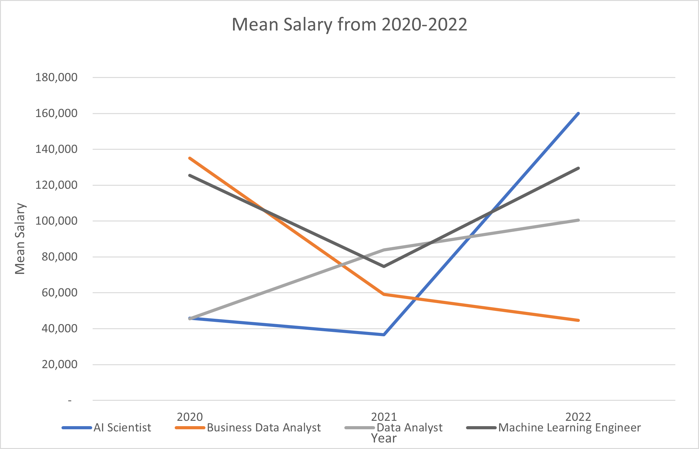

```{r setup, include=FALSE}
knitr::opts_chunk$set(echo = TRUE)
library(knitr)
knitr::opts_knit$set(root.dir= normalizePath('..'))
```

## Investigation

The question this investigation set out to answer is to firstly see which full time job is the highest paying and secondly what the highest and lowest year on year difference between full time employees are for their respective job titles.

This information will allow people who are looking to change job roles or perhaps look into a new field make an informed decision of which roles pays the best, albeit with a small sample size of data and in some cases, missing information.

## Data

The data used for this investigation is from the ds_salaries.csv, which contains the following information, work year, experience level, employment type, job title, salary, salary current, salary in USD, employee residence, remote ratio, company location and company size.

For the purpose for this analysis, the data was transformed to display the sample mean for each job title, for each year from 2020 to 2022. Only jobs with data spanning across all 3 years was used as part of this analysis to show the increase or decrease over the period. The data was was aggregated and the sample mean of each salary was figured out over each of the 3 years. This allowed for the increase or decrease of between the years to be worked out.

It is important to note that this analysis only took into account the full time employees to avoid skewed data such as an increased rate for contractors. It is also important to note that the employee residence and experience level were not taken into account as this investigation set out to explore which branch of data science was most profitable.

All salaries in the mean salaries table below are using the the USD conversion to allow for like for like comparison.

| Job Title                                | mean 2020 | mean 2021 | mean 2022 | difference 20_21 | difference 21_22 |
|------------|------------|------------|------------|------------|------------|
| AI Scientist                             | 45,896    | 36,526    | 160,000   | -26%             | 77%              |
| Business Data Analyst                    | 135,000   | 59,102    | 44,677    | -128%            | -32%             |
| Data Analyst                             | 45,547    | 83,827    | 100,550   | 46%              | 17%              |
| Data Engineer                            | 88,162    | 85,758    | 127,187   | -3%              | 33%              |
| Data Science Manager                     | 190,200   | 143,126   | 170,196   | -33%             | 16%              |
| Data Scientist                           | 89,185    | 70,671    | 137,136   | -26%             | 48%              |
| Director of Data Science                 | 325,000   | 168,707   | 196,979   | -93%             | 14%              |
| Lead Data Engineer                       | 90,500    | 179,720   | 118,187   | 50%              | -52%             |
| Machine Learning Engineer                | 125,389   | 74,611    | 129,451   | -68%             | 42%              |
| Machine Learning Infrastructure Engineer | 50,180    | 195,000   | 58,255    | 74%              | -235%            |
| Machine Learning Scientist               | 260,000   | 190,000   | 141,766   | -37%             | -34%             |
| Principal Data Scientist                 | 148,261   | 194,940   | 162,674   | 24%              | -20%             |
| Research Scientist                       | 246,000   | 83,003    | 105,569   | -196%            | 21%              |

: Mean of salaries over the 3 year period of the job roles with data across all 3 years.

From the table, we can see that in two of the years, "Director of Data Science" was the most lucrative role with \$325,000 and \$196,979 in 2020 and 2022 respectively. Whereas in 2021, "Machine Learning Infrastructure Engineer" was the most lucrative with a salary of \$195,000. Whilst this shows the roles in which has the highest average for that year, it does not take into account how many of these types of roles are available and therefore do not represent a more realistic, attainable role such as "Data Analyst", which looking at the raw data, has 96 entries compared to the 7 entries for the Director role which suggests there are many more Data analyst roles available as opposed to Director roles.

From the table, we can also see that in many cases, the percentage difference from 2020 to 2021 is negative, which means that the mean salary over those two years decreased with the exception of "Data Analyst", "Lead Data Engineer" and "Principal Data Scientist" roles which all rose between 46-74%.

Looking at the last column, the percentage different from 2021 to 2022, many percentage changes are now positive, which suggests there is an increase in salaries. Whats interesting in this column is that for the mean salary of "Machine Learning Infrastructure Engineer" for 2022 is \$58,255 as opposed to the \$190,000 of the previous year which suggests that the mean for 2021 was an outlier.

<center>

{width="369"}

</center>

